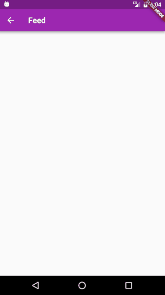

# flutter_feed

A simple flutter application to be a "news ticker" for
events. To accomplish this, it uses a [Redis](https://redis.io/)
database backend and ```psub```s to the ```feed.*``` channel. 



## Requirements
 * Redis Server avilable on the network
 * [Flutter](http://flutter.io)
 * [Dart](https://www.dartlang.org/)

## To Do:

- [ ] Provide Screenshots
- [x] Add a Time field to the ```Message``` class
- [ ] Unit Tests
- [ ] Improved theme
- [ ] Fix or remove Back arrow button
- [x] Word Wrap the message